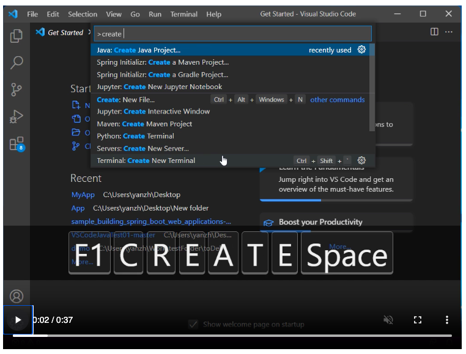
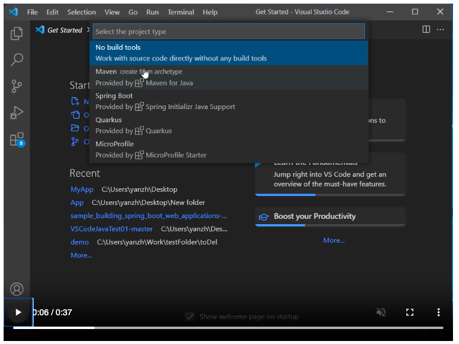
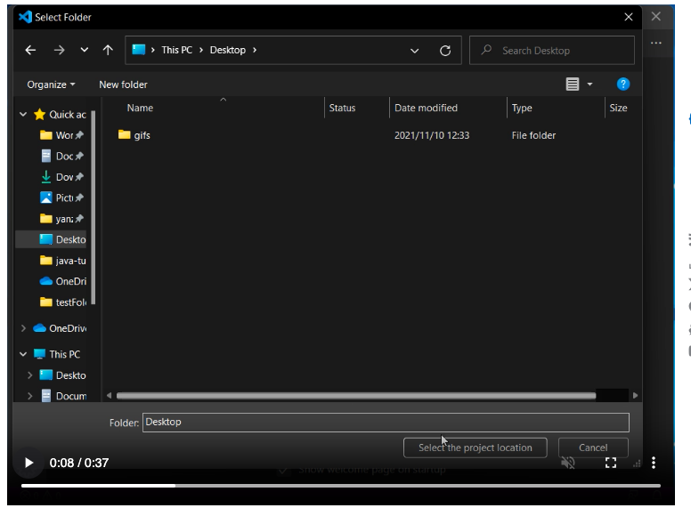
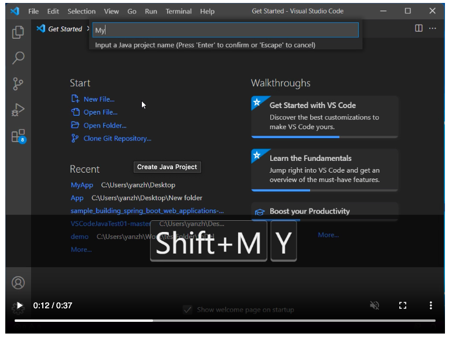
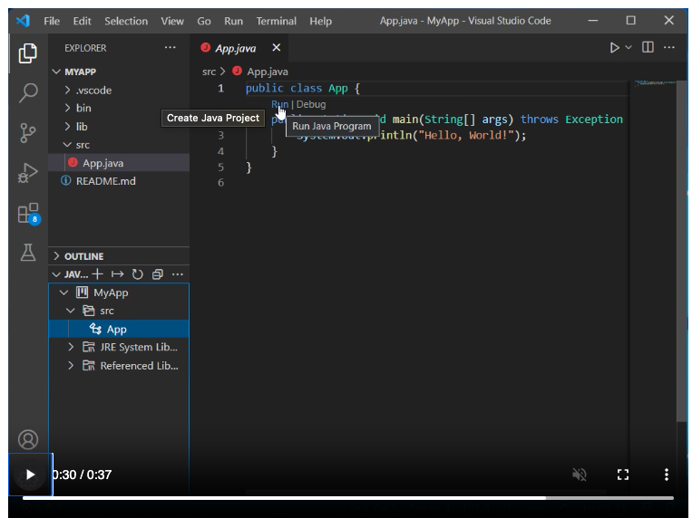

//Create JAVA project using “Java: Create Java Project”

Step1:
type java and then select Create Java project

Step2:
Select no build tools for project type

Step3:
Select your project folder

Step4:
Create App.java (any java file)

Step5:
Click on App.java and click Run written above main method

