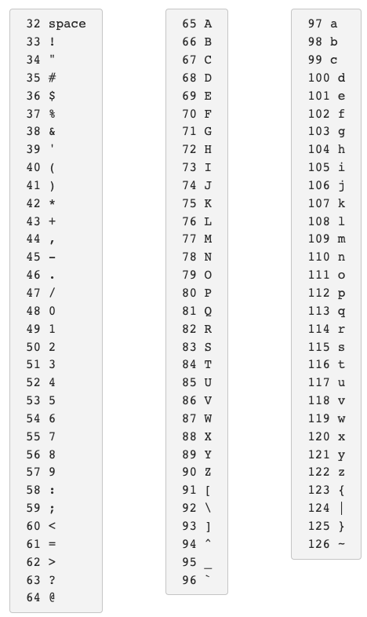
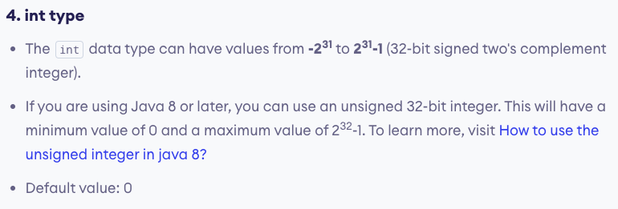

https://web.stanford.edu/class/cs101/bits-bytes.html

Bits and Bytes
At the smallest scale in the computer, information is stored as bits and bytes. In this section, we'll learn how bits and bytes encode information.

Bit
a "bit" is atomic: the smallest unit of storage
A bit stores just a 0 or 1
"In the computer it's all 0's and 1's" ... bits
Anything with two separate states can store 1 bit
In a chip: electric charge = 0/1
In a hard drive: spots of North/South magnetism = 0/1
A bit is too small to be much use
Group 8 bits together to make 1 byte
Everything in a computer is 0's and 1's. The bit stores just a 0 or 1: it's the smallest building block of storage.

Byte
One byte = collection of 8 bits
e.g. 0 1 0 1 1 0 1 0
One byte can store one character, e.g. 'A' or 'x' or '$'
How Many Patterns With N Bits? (demo)
How many different patterns can be made with 1, 2, or 3 bits?

Number of bits	Different Patterns
1	0 1
2	00 01 10 11
3	000 001 010 011
100 101 110 111
3 bits vs. 2 bits
Consider just the leftmost bit
It can only be 0 or 1
Leftmost bit is 0, then append 2-bit patterns
Leftmost bit is 1, then append 2-bit patterns again
3-bits has twice as many patterns as 2-bits
Number of bits	Different Patterns
1	0 1
2	00 01 10 11
3	000 001 010 011
100 101 110 111
In general: add 1 bit, double the number of patterns
1 bit - 2 patterns
2 bits - 4
3 bits - 8
4 bits - 16
5 bits - 32
6 bits - 64
7 bits - 128
8 bits - 256 - one byte
Mathematically: n bits yields 2n patterns (2 to the nth power)
One Byte - 256 Patterns (demo)
1 byte is group of 8 bits
8 bits can make 256 different patterns
How to use the 256 patterns?
How to store a number in a byte?
Start with 0, go up, one pattern per number, until run out of patterns
0, 1, 2, 3, 4, 5, ... 254, 255
One byte can hold a number between 0 and 255
i.e. with 256 different patterns, we can store a number in the range 0..255
Really good for storing characters/letters.
Bytes
"Byte" - unit of information storage
A document, an image, a movie .. how many bytes?
1 byte is enough to hold about 1 typed character, e.g. 'b' or 'X' or '$'
All storage is measured in bytes, despite being very different hardware
Kilobyte, KB, about 1 thousand bytes
Megabyte, MB, about 1 million bytes
Gigabyte, GB, about 1 billion bytes
Terabyte, TB, about 1 trillion bytes (rare)
Bytes and Characters - ASCII Code
ASCII is an encoding representing each typed character by a number
Each number is stored in one byte (so the number is in 0..255)
A is 65
B is 66
a is 96
space is 32
"Unicode" is an encoding for mandarin, greek, arabic, etc. languages, typically 2-bytes per "character"

Typing, Bytes, and You
Each letter is stored in a byte, as below
100 typed letters takes up 100 bytes
When you send, say, a text message, the numbers are sent
Text is quite compact, using few bytes, compared to images etc.

typed letters correspond to bytes in RAM
Numbers in Computers
One byte works well for individual characters, but computers are also good at manipulating numbers.
Integers are typically stored with either 4 or 8 bytes
4 bytes can store numbers between -2147483648 and 2147483647
8 bytes can store numbers between -9223372036854775808 and 9223372036854775807
Adding in binary is just like normal addition with carrying
But when you run out of bits you can't carry anymore
Leftmost bit indicates sign, so carrying to the leftmost bit changes a number ffrom positive to negative.
So adding 1 to 2147483647 goes to -2147483648!
Called Integer Overflow
Integer Overflow and Gangam Style

# The maximum value of this number type, 2,147,483,647, is well known to C programmers as INT_MAX. Once INT_MAX is reached, attempting to record another view will normally roll over to -2,147,483,648.

