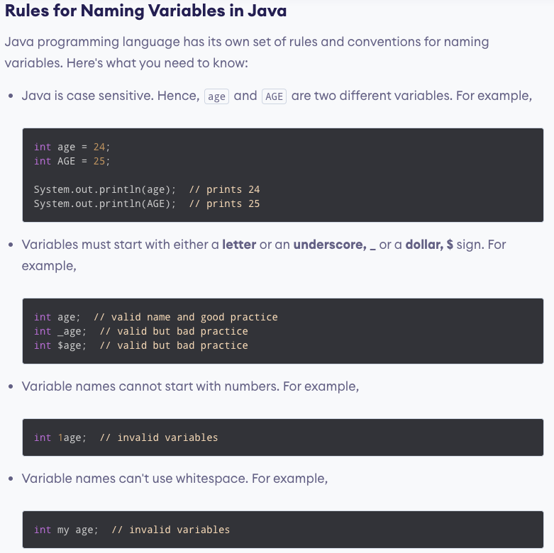

Note: Java is a statically-typed language. It means that all variables must be declared before they can be used.

However, we cannot change the data type of a variable in Java within the same scope.

In Java, binary starts with 0b, octal starts with 0, and hexadecimal starts with 0x.