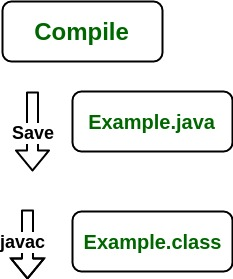
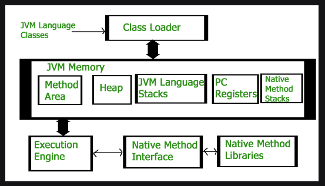

1. JDK (Java Development Kit) is a Kit that provides the environment to develop and execute(run) the Java program. JDK is a kit(or package) that includes two things

Development Tools(to provide an environment to develop your java programs)
JRE (to execute your java program).
2. JRE (Java Runtime Environment) is an installation package that provides an environment to only run(not develop) the java program(or application)onto your machine. JRE is only used by those who only want to run Java programs that are end-users of your system.

3. JVM (Java Virtual Machine) is a very important part of both JDK and JRE because it is contained or inbuilt in both. Whatever Java program you run using JRE or JDK goes into JVM and JVM is responsible for executing the java program line by line, hence it is also known as an interpreter.

Now let us discuss the components of JRE in order to understand its importance of it and perceive how it actually works. For this let us discuss components.

The components of JRE are as follows:

Deployment technologies, including deployment, Java Web Start, and Java Plug-in.
User interface toolkits, including Abstract Window Toolkit (AWT), Swing, Java 2D, Accessibility, Image I/O, Print Service, Sound, drag, and drop (DnD), and input methods.
Integration libraries, including Interface Definition Language (IDL), Java Database Connectivity (JDBC), Java Naming and Directory Interface (JNDI), Remote Method Invocation (RMI), Remote Method Invocation Over Internet Inter-Orb Protocol (RMI-IIOP), and scripting.
Other base libraries, including international support, input/output (I/O), extension mechanism, Beans, Java Management Extensions (JMX), Java Native Interface (JNI), Math, Networking, Override Mechanism, Security, Serialization, and Java for XML Processing (XML JAXP).
Lang and util base libraries, including lang and util, management, versioning, zip, instrument, reflection, Collections, Concurrency Utilities, Java Archive (JAR), Logging, Preferences API, Ref Objects, and Regular Expressions.
Java Virtual Machine (JVM), including Java HotSpot Client and Server Virtual Machines.
After having an adequate understanding of the components, now let us discuss the working of JDK. In order to understand how JDK works, let us consider an illustration below as follows:

Illustration:

Consider a java source file saved as ‘Example.java’. The file is compiled into a set of Byte Code that is stored in a “.class” file. Here it will be “Example.class“. 

Compile time

Note: From above, media operation computing during the compile time can be interpreted.

The following actions occur at runtime as listed below:

Class Loader
Byte Code Verifier
Interpreter
Execute the Byte Code
Make appropriate calls to the underlying hardware
Now let us discuss in brief how JVM works out. It is as follows:

JVM becomes an instance of JRE at the runtime of a Java program. It is widely known as a runtime interpreter.JVM largely helps in the abstraction of inner implementation from the programmers who make use of libraries for their programs from JDK. 

It is mainly responsible for three activities. 

Loading
Linking
Initialization
Similarly, now let us discuss the working of JRE which is as follows:

JVM(Java Virtual Machine) acts as a run-time engine to run Java applications. JVM is the one that actually calls the main method present in a java code. JVM is a part of JRE(Java Runtime Environment).
Java applications are called WORA (Write Once Run Anywhere). This means a programmer can develop Java code on one system and can expect it to run on any other Java-enabled system without any adjustments. This is all possible because of JVM.
When we compile a .java file, .class files(contains byte-code) with the same class names present in .java file are generated by the Java compiler. This .class file goes into various steps when we run it. These steps together describe the whole JVM.

